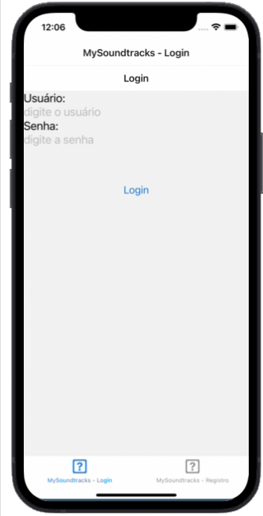
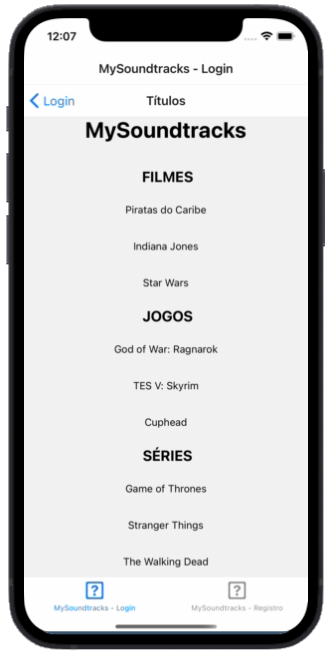
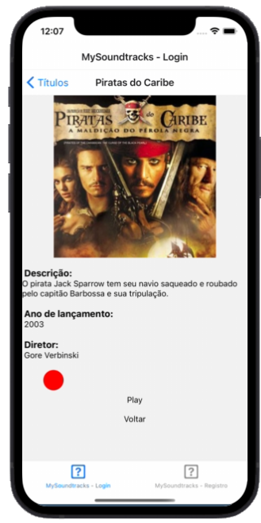

# Soundtrack-App

## ℹ️ Description

A movie, series and game soundtrack app with a login and registration system developed with React.

⚠️Some parts of the code may be written in Portuguese-BR, please use google translator if you need.

## 👁️‍🗨️ Preview 

  

Img 01. Login and Register screen.

  

Img 02. Menu with movies, series and games.

  

Img 03. Content page with description, image, play button, sound and API animation.

## 🛠️ **Technologies**

&nbsp;
&nbsp;
&nbsp;
&nbsp;
